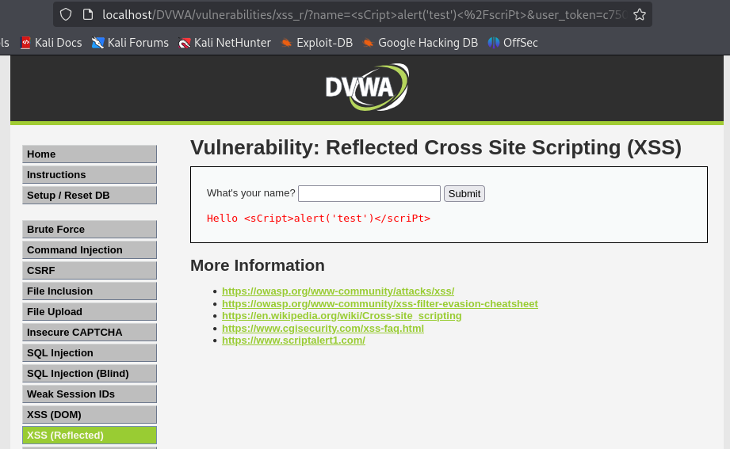
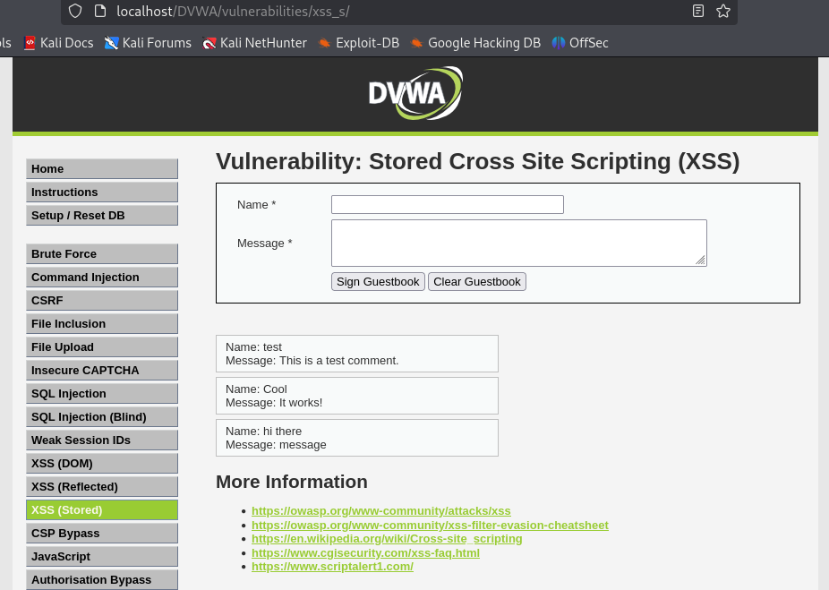

# XSS Vulnerability Scanner
[](https://choosealicense.com/licenses/mit/)
## Description
This cross-site scripting (XSS) vulnerability scanner project uses Python script tested on DVWA using XAMPP within a Kali Linux VirtualBox VM. Once all technologies are set up, the script is started and locates the target DVWA URL. We then can test XSS Reflected and XSS Stored vulnerabilities from the accessible tabs on the DVWA site. The following provides some background explanation on Cross-Site Scripting(XSS):

Cross-Site Scripting (XSS) attacks are a type of injection, in which malicious scripts are injected into otherwise benign and trusted websites. XSS attacks occur when an attacker uses a web application to send malicious code, generally in the form of a browser side script, to a different end user. Flaws that allow these attacks to succeed are quite widespread and occur anywhere a web application uses input from a user within the output it generates without validating or encoding it. An attacker can use XSS to send a malicious script to an unsuspecting user. The end user’s browser has no way to know that the script should not be trusted, and will execute the script. Because it thinks the script came from a trusted source, the malicious script can access any cookies, session tokens, or other sensitive information retained by the browser and used with that site. These scripts can even rewrite the content of the HTML page. (Source: OWASP)

## Table of Contents
- [XSS Vulnerability Scanner](#xss-vulnerability-scanner)
  - [Description](#description)
  - [Table of Contents](#table-of-contents)
  - [Languages \& Technologies Used](#languages--technologies-used)
  - [Installation](#installation)
  - [Usage](#usage)
  - [Questions](#questions)
  - [License](#license)


## Languages & Technologies Used

[](https://www.kali.org/)

[](https://www.virtualbox.org/wiki/Documentation)

[](https://www.python.org/)

[](https://www.apachefriends.org/)

[](https://www.apachefriends.org/)


## Installation
Download and Install VirtualBox for OS. (https://www.virtualbox.org/wiki/Downloads)

Download and Extract files for Kali Linux Pre-Built Virtual Machines for VirtualBox. (https://www.kali.org/get-kali/#kali-virtual-machines)

Import the Pre-Made Kali VirtualBox VM and adjust RAM and CPU settings to your preferences. (https://www.kali.org/docs/virtualization/import-premade-virtualbox/)

Start up your VM. The rest of the installation and usage is going to be within the VM. 

Download and Install Python3 and required libraries needed to run the scanner.
```
sudo apt update
sudo apt install python3
pip3 install requests beautifulsoup4

```

Download and Install XAMPP (Includes: Apache, MariaDB, PHP, and Perl). (https://www.apachefriends.org/)

Clone the DVWA (Damn Vulnerable Web Application) repo from GitHub to your preferred file location. 
```
git clone https://github.com/digininja/DVWA 
```
Clone this repository from GitHub to your desired file location.
```
git clone https://github.com/dsoda86/xss-scanner.git
```
  
## Usage
NOTE: You might have to troubleshoot some file permissions/privileges, locations, adjust config.inc / login.css files, or MySQL database configurations depending on what versions Linux/Python/XAMPP you are using. Please refer to documentation or use other resources to get everthing up and running.
Start VirtualBox.
Start your pre-made Kali Linux VM.

Within the VM:

Start XAMPP and make sure Apache and MySQL both say that they are running as well. In the terminal, use:
```
sudo /opt/lampp/lampp start
```

Navigate to "http://localhost/DVWA/" in the browser. Login with the default DVWA credentials.

In the terminal, navigate to the xss-scanner folder from the github repo. Then, activate a virtual environment and run the Python Script:
```
source ~/Your_Preferred_Directory/xss-scanner/venv/bin/activate
python dvwa-scanner.py
```
Your should see something like this result in the terminal:
```
All libraries are successfully imported!
Found: http://localhost/DVWA/dvwa/css/login.css
```

Go back to your open DVWA in the browser and click on the XSS Reflected tab. Copy and past your "<sCript>alert('test')</scriPt>" into the text field and submit. You should be able to see "Hello <sCript>alert('test')</scriPt>" under the text field. 



Next, click on the XSS Stored tab and type whatever name and message you want. When you click to "sign guestbook", you can see the saved name and message under the form field for wehatever the user entered. 



When you are done, you can deactivate your venv in the terminal.
```
deactivate
```

## Questions
Check out my work at  
[](https://github.com/dsoda86)


Please send your questions to  [dsoda86@gmail.com](mailto:dsoda86@gmail.com?subject=[GitHub]%20Dev%20Connect).
## License
Click to learn more about this license and other commonly used licenses.

[](https://choosealicense.com/licenses/)


